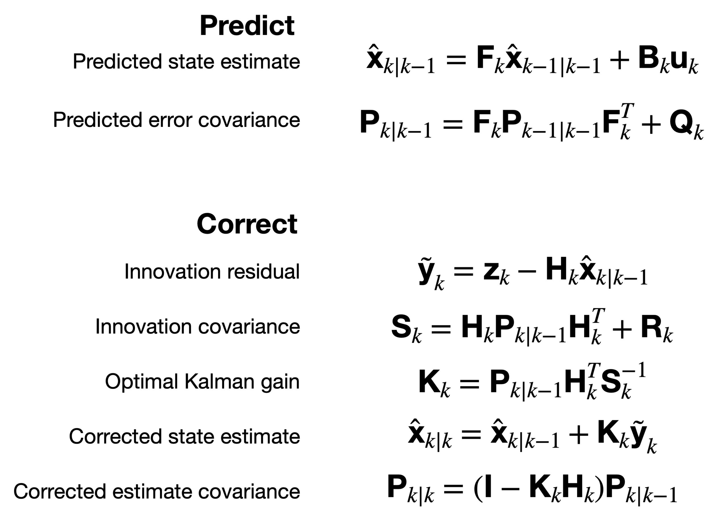
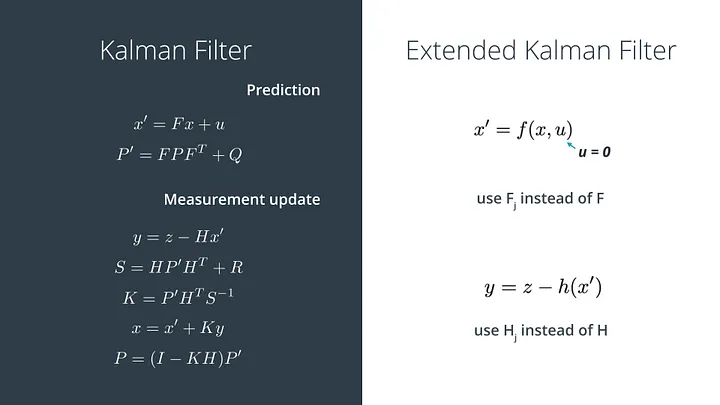

# proj4_group2

## Data Collection Using Turtlebot 3

["Video Controlling TurtleBot"](https://drive.google.com/file/d/1w8894PAhPiHxX0CNOtRNaqFdzJPt3LTD/view?usp=drive_link)

## How to run

## 1. Step 1 creating workspace

```bash
mkdir -p ~/project_2/
cd ~/project_2/
```

## 2.  Clone the repo from github

```bash
git clone https://github.com/Robust-Autonomous-Systems-Laboratory/proj4_group2.git
```
## 3. Build and source the package

```bash
colcon build --symlink-install
source install/setup.bash
```
## 4. Run the Node

```bash
ros2 run  gaussian_filters {filter_node_name}
```
### for filter node names

- kf_node - *linear kalman filter*
- ekf_node - *extended kalman filter*
- ukf_node - *uncented kalman filter*

## 5. Assuming lab4_ws is availabe (open new terminal)

```bash
source install/setup.bash
ros2 launch turtlebot3_bringup rviz2.launch.py
```

this should open rviz and the  turtlebot model

## 6. In RViz
- change the odometry -> topic to either /kf_odom or ekf_odom or ukf_odom

- Add path and change the topic to either /kf_path or ekf_path or ukf_path


## 7 Play the bag file (open new terminal)
```bash
ros2 bag play rosbag2_final/
```

#Results

### original path
[Original turtlebot Path](https://drive.google.com/file/d/1M3GS-HBBsPAQHpfanFckYKMevcS0AF4d/view?usp=drive_link)

### kalman Filter path
[Linear kalman Filter path](https://drive.google.com/file/d/1rtn-A6TI9-LKAW1CR6aSqYJBUadHXm5z/view?usp=drive_link)

### Extended Kalman Filter path
[Extended Kalman Filter Path](https://drive.google.com/file/d/13g86uhJ_kbMDIatN4GSjN359K1t7rbLi/view?usp=drive_link)

### Unscented kalmman Filter path
[Unscented kalmman Filter path](https://drive.google.com/file/d/1ZsBikyhNpfsjCv-U4DxIJ7LtwDQv45e3/view?usp=drive_link)


## Formulars used

### Linear Kalman Filter


### Extended Kalman Filter

